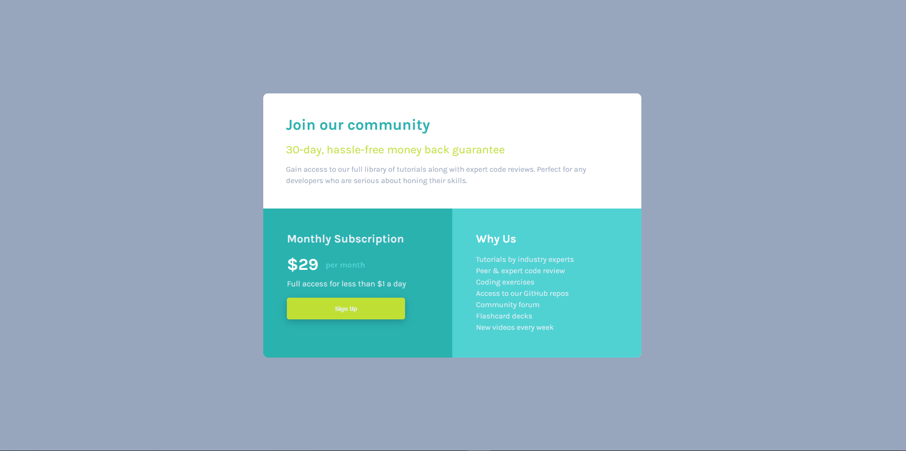

# Frontend Mentor - Single price grid component solution

This is a solution to the [Single price grid component challenge on Frontend Mentor](https://www.frontendmentor.io/challenges/single-price-grid-component-5ce41129d0ff452fec5abbbc). Frontend Mentor challenges help you improve your coding skills by building realistic projects. 

## Table of contents

- [Overview](#overview)
  - [The challenge](#the-challenge)
  - [Screenshot](#screenshot)
  - [Links](#links)
- [My process](#my-process)
  - [Built with](#built-with)
  - [What I learned](#what-i-learned)
  - [Continued development](#continued-development)
  - [Useful resources](#useful-resources)
- [Author](#author)
- [Acknowledgments](#acknowledgments)

**Note: Delete this note and update the table of contents based on what sections you keep.**

## Overview

### The challenge

Users should be able to:

- View the optimal layout for the component depending on their device's screen size
- See a hover state on desktop for the Sign Up call-to-action

### Screenshot




### Links

- Solution URL: [Check out the code here](https://github.com/TheCoderGuru/single-price-grid-component)
- Live Site URL: [Visit the live site here](https://single-price-grid-component-red-eight.vercel.app/)

## My process

### Built with

- Semantic HTML5 markup
- CSS custom properties
- Flexbox
- CSS Grid
- Mobile-first workflow

**Note: These are just examples. Delete this note and replace the list above with your own choices**

### What I learned

I learnt that in order to have content span only one column while using css grid, you use ```grid-column: span 1```.


### Continued development

I plan to try using css grid as much possible in order to become more comfortable with all of its various properties and its use cases.


### Useful resources

- [CSS Tricks - CSS Grid](https://css-tricks.com/snippets/css/complete-guide-grid/) - This helped me with the flexbox concept and I am really glad to be recommend this article, will use it going forward.

- [MDN CSS Reference](https://developer.mozilla.org/en-US/docs/Web/CSS) - This is the guide to all the css properties with an indept explanation. Definitely recommend it.


## Author

- Frontend Mentor - [@TheCoderGuru](https://www.frontendmentor.io/profile/TheCoderGuru)
- Twitter - [@TheCoderGuru](https://www.twitter.com/TheCoderGuru)


